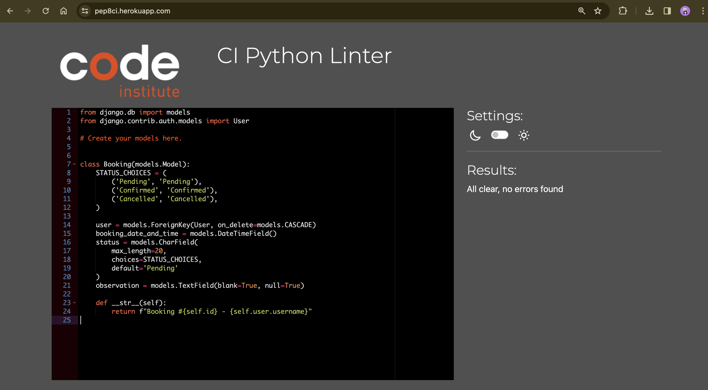

# Jen's Tyre Centre Web Development Project

Welcome to the Jen's Tyre Centre web development project repository! This project is aimed at providing a comprehensive web solution for managing tyre services and booking management.

## Table of Contents

- [Introduction](#introduction)
- [Technologies Used](#technologies-used)
- [Project Structure](#project-structure)
- [Installation](#installation)
- [Usage](#usage)
- [Manual Testing](#manual-testing)
- [Deployment](#deployment)
- [User Stories](#user-stories)
- [Future Features](#future-features)
- [Bugs](#bugs)
- [Credits](#credits)

## Introduction

Jen's Tyre Centre is a web development project created to offer a platform for managing tyre services, appointments, and customer information. It provides a user-friendly interface for both customers and administrators to interact with the system.

## Technologies Used

The project is built using the following technologies:

- Django (MVC framework)
- Django AllAuth (Authentication and Authorization)
- HTML/CSS/JavaScript (Front-End)
- PostgreSQL (Database)
- Git/GitHub (Version Control)
- Heroku (Cloud-based Platform)
- WhiteNoise (Static Files)

## Project Structure
- **Root Directory:** The root directory holds the main Django server project Tyre-Centre, installed packages , `README.md`, and additional file helper e.g HTML, CSS, JS, IMG.
- `requirements.txt`: Python dependencies list.
- `runtime.txt`: The targeted Python runtime.
- **Django Project:**
  - `Garage`: Contains the Django app files.
- **Django App:**
  - `mainpage`: Contains the Django app files.
- **Static files:**
  - `static`: Holds CSS, JavaScript, and other static files.
- **Templates:**
  - `templates`: Contains base.html template.

## Installation

To set up the project locally, follow these steps:

1. Clone the repository:
git clone <repository-url>
cd tyre-centre
2. Install the long-term supported (LTS) release of  Django version 4 and add the package to the requirements.txt file
`pip3 install Django~=4.2.1` `pip3 freeze local > requirements.txt`
3. Create a new project
`django-admin startproject [project name] .`
4. Create the new app
`python3 manage.py startapp [app name]`
5. In settings.py, add the app to the list of installed apps.
6. Configure the PostgreSQL database URL in Django settings.
    - Create an instance of a cloud-based PostgreSQL database and connect it to our project
    - ElephantSQL is a PostgreSQL database used in this project. [Steps to create an account](https://code-institute-students.github.io/deployment-docs/02-elephantsql/elephantsql-01-sign-up)
7. After adding models run migrations:
`python manage.py migrate`
8. Run the development server
`python3 manage.py runserver`

These steps should prepare your environment for Django development. Ensure that you're within the virtual environment whenever you work on the project.

## Usage

In the website, users are able to perform the following actions:

- **Registration**: Users can register for an account.
- **Login**: Registered users can log in to their accounts.
- **Logout**: Users can log out of their accounts.
- **Booking Management**: When logged in, users can manage their bookings by editing and deleting them.
- **Booking Management Tab**: In the management tab, users can:
  - View their booking status (pending, cancelled, confirmed).
  - View the observation field associated with their booking.
  - Take action on their bookings using two action buttons: edit and delete.

## Manual Testing

I have manually tested this website project to ensure smooth user experience and proper system functionality by performing the following actions:

- Navigated through various pages and functionalities multiple times to ensure smooth navigation and functionality across different scenarios.

- **Booking an Appointment:** 
  - Attempted to book an appointment through the website interface, ensuring that all required fields are properly filled.

- **Editing a Booking:**
  - Edited an existing booking, updating information such as date, time, or service type.
  - Ensured that changes made during editing are correctly saved and reflected in the system.
  - Verified that editing is only allowed for pending appointments.

- **Observation Box:**
  - Added text in the observation box during booking to provide additional notes or instructions.
  - Verified that the entered text is properly saved and displayed in the booking details.

- **Deleting a Booking:**
  - Attempted to delete both pending and confirmed appointments.
  - Verified that pending appointments can be successfully deleted, while confirmed appointments are protected from deletion.
  - Ensured that the page redirects appropriately after deletion, navigating back to the booking page.

- Verified that user inputs are appropriately validated and error messages are displayed as expected.
- Ensured consistency in design elements and layout across different browsers and screen sizes.
- Cross-checked the website's appearance and functionality on both desktop and mobile devices to ensure responsiveness.
- Reviewed the console for any JavaScript errors.
- Ran the website through a code validator to ensure compliance with Python standards.
- Verified the functionality of interactive elements such as buttons, links, and dropdown menus.
- Checked the behavior of dynamic content and data retrieval from the backend.
- Tested the website's security measures such as HTTPS implementation and protection against common vulnerabilities like XSS and CSRF.
- Ensured proper handling of user authentication and authorisation, including login, logout, and access control.
- Conducted end-to-end testing of critical user workflows, such as registration, booking appointments, and managing user profiles.
- Verified that data persistence is maintained across sessions and interactions with the website.
- Documented and addressed any bugs or issues encountered during testing, ensuring thorough regression testing after fixes.
- Tested the project in both my local development environment and the deployed production environment to ensure consistency.

By conducting these manual tests, I aimed to ensure the overall quality, reliability, and user experience of the website across different usage scenarios and environments.

## Deployment to Heroku

To deploy your project to Heroku, follow these steps:

1. **Create an account and verify it:**
   - Sign up for a Heroku account and verify your email address.

2. **Create a new app:**
   - Navigate to your Heroku dashboard and create a new app with a unique name.

3. **Install**   
    - Update your code for deployment, e.g. using gunicorn, which will be required, rather than Django’s runserver.
   - `pip3 install gunicorn~=20.1` `pip3 freeze --local > requirements.txt`
   - creat a Procfile at the root directory of the project and declare the process as web and add a start command: 
   `web: gunicorn [project name].wsgi`

3. **Enable GitHub integration:**
   - In your app's dashboard, go to the Deploy tab.
   - In the Deployment method section, enable GitHub integration by clicking on "Connect to GitHub".

4. **Select your repository:**
   - Start typing your project repository name into the search box and click Search.
   - A list of repositories from your GitHub account should appear.
   - Click on the GitHub repository you want to deploy from.

5. **Initiate deployment:**
   - Scroll to the bottom of the page and click "Deploy Branch" to start a manual deployment of the main branch.

6. **View your deployed project:**
   - Once the deployment process is complete, click on "Open app" to view your deployed project.

## User Stories

### User
- **I can** browse available tyre services.
- **I can** book an appointment.
- **I can** edit an appointment.
- **I can** delete an appointment that is pending.
- **I can** write and observation every appointment I make.
- **I can** view my appointment history.

### Administrator
- **I can** manage tyre services offered by the centre.
- **I can** view user appointments.
- **I can** manage user appointments.
- **I can** confirm or refuse user appointments.
- **I can** view user username but not password.

### Project Management
- **I can** prioritise user stories and tasks.
- **I can** assign tasks to team members.
- **I can** track progress and milestones.

## Future Features
- Set calendar to working hours
    - Implement functionality to set the booking calendar to reflect the working hours of the tyre centre, ensuring that user can only book appointments during operational hours.
- Prevent booking multiple appointments for the same time slot
    - Enhance the booking system to prevent users from booking multiple appointments for the same time slot, ensuring a fair scheduling system and avoiding conflicts.
- Ask confirmation before deleting a booking
    - Implement a confirmation prompt when users attempt to delete their booking, ensuring that they confirm their action before the booking is permanently removed.
- Activate Remember Me and forgot password functionalities in Sign In page

## Bugs
- User can book multiple appointments for the same time slot
    - Address the issue where users are able to book multiple appointments for the same time slot, which can lead to scheduling conflicts and confusion.

## Difficulties encountered 
- I encountered a problem while trying to run `pip3 install dj-database-url~=0.5 psycopg2~=2.9`
- I managed to get the packages installed successfully by running the following command: `pip3 install dj-database-url~=0.5 psycopg2-binary~=2.9` as suggested in the error message and CI.
- 

## Credits
- Source of mechanic girl icon: FLATICON by kerismaker
- Source of car image in services section: FLATICON by Luxica Garage Car Repair
- Source of location icon in footer: FLATICON by freepik
- Source of phone icon in footer: FLATICON by freepik

